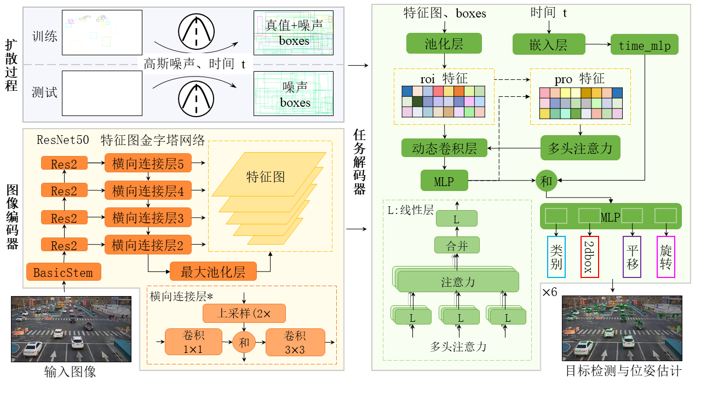

## DiffDetPose:Diffusion model applied to object detection and pose estimation in roadside traffic scenes

**DiffDetPose is an integrated method of object detection and pose estimation based on diffusion model.**



<!-- TABLE OF CONTENTS -->
<details open="open" style='padding: 10px; border-radius:5px 30px 30px 5px; border-style: solid; border-width: 1px;'>
  <summary>Table of Contents</summary>
  <ol>
    <li>
      <a href="#Installation">Installation</a>
    </li>
    <li>
      <a href="#Steps">Steps</a>
    </li>
    <li>
      <a href="#Inference Demo">Inference Demo</a>
    </li>   
    <li>
      <a href="#Experimental Results">Experimental Results</a>
    </li>
  </ol>
</details>

<br/>

### Installation

The codebases are built on top of [Detectron2](https://github.com/facebookresearch/detectron2), [Sparse R-CNN](https://github.com/PeizeSun/SparseR-CNN), and [denoising-diffusion-pytorch](https://github.com/lucidrains/denoising-diffusion-pytorch).
Thanks very much.

#### Requirements
- Python ≥ 3.9.0
- PyTorch ≥ 2.3.0 and [torchvision](https://github.com/pytorch/vision/) that matches the PyTorch installation.
  You can install them together at [pytorch.org](https://pytorch.org) to make sure of this
- OpenCV is optional and needed by demo and visualization
- mmcv-full ≥ 1.7.2

### Steps
1. Install Detectron2 following https://github.com/facebookresearch/detectron2/blob/main/INSTALL.md#installation. You can also use the version we uploaded directly.

2. Prepare datasets
please download the source data sets from https://thudair.baai.ac.cn/rope, and run read_dataset/read_rope3d_dataset.py, save as a .pkl forms of true value. Create a new data directory and save .pkl to it.

3. Prepare pretrain models
Create a new models directory and place the pre-training weights in it.

4. Train DiffusionDet
```
python train_net.py --num-gpus 8 \
    --config-file configs/diffdetpose.rope3d.res50.yaml
```

5. Evaluate DiffusionDet

We provide [weights](https://drive.google.com/drive/folders/1bJxTzp-iMvmiND8VVHTFTW46YqzzxBkW?usp=drive_link) for use with ResNet50 and ResNet101 for easy evaluation.
```
python train_net.py --num-gpus 8 \
    --config-file configs/diffdetpose.rope3d.res50.yaml \
    --eval-only MODEL.WEIGHTS path/to/model.pth
```

### Inference Demo
We provide a command line tool to run a simple demo following [Detectron2](https://github.com/facebookresearch/detectron2/tree/main/demo#detectron2-demo).

```bash
python demo.py --config-file configs/diffdetpose.rope3d.res50.yaml \
    --input image.jpg --opts MODEL.WEIGHTS diffdetpose_rope3d_res50.pth
```

We need to specify `MODEL.WEIGHTS` to a model from model zoo for evaluation.
This command will run the inference and show visualizations in an OpenCV window.

### Experimental Results

The experimental results for the object detection task are shown in the following figure.
<table>
  <tr>
    <th>方法/指标</th>
    <td>car</td>
    <td>truck</td>
    <td>bus</td>
    <td>pedestrian</td>
    <td>mAP</td>
  </tr>
  <tr>
    <td>BevHeight</td>
    <td>61.53</td>
    <td>52.92</td>
    <td>61.66</td>
    <td>16.74</td>
    <td>48.21</td>
  </tr>
  <tr>
    <td>DiffDetPose</td>
    <td>77.34</td>
    <td>71.14</td>
    <td>76.06</td>
    <td>45.44</td>
    <td>67.50</td>
  </tr>
</table>

The experimental results of the pose estimation task are shown in the figure below.

<table>
  <tr>
    <th rowspan="2">方法/指标</th>
    <th colspan="2">car</th>
    <th colspan="2">truck</th>
    <th colspan="2">bus</th>
    <th colspan="2">pedestrian</th>
  </tr>
  <tr>
    <th>5m5°</th>
    <th>5m15°</th>
    <th>5m5°</th>
    <th>5m15°</th>
    <th>5m5°</th>
    <th>5m15°</th>
    <th>5m5°</th>
    <th>5m15°</th>
  </tr>
  <tr>
    <td>BevHeight</td>
    <td>59.70</td>
    <td>73.11</td>
    <td>31.63</td>
    <td>36.12</td>
    <td>67.68</td>
    <td>73.90</td>
    <td>6.22</td>
    <td>11.06</td>
  </tr>
  <tr>
    <td>DiffDetPose</td>
    <td>62.28</td>
    <td>67.41</td>
    <td>47.44</td>
    <td>52.57</td>
    <td>63.64</td>
    <td>65.83</td>
    <td>16.31</td>
    <td>27.78</td>
  </tr>
</table>


